# Manual de usuario del CRM BOPACORP

**Sistema:** BOPACORP CRM  
**Versión del manual:** 0.1  
**Fecha:** 14 de agosto de 2026  
**Dirigido a:** asesores, supervisores, coordinadores, managers, administradores y usuarios de empleabilidad.

> **Nota para la edición final:** las capturas incluidas son evidencia visual disponible del CRM. Antes de entregar el manual, se debe verificar que no contengan datos personales, reemplazar cualquier dato sensible y completar las capturas marcadas como pendientes.

---

## 1. Propósito del sistema

BOPACORP CRM es la aplicación web utilizada para organizar la relación comercial con clientes empresariales, controlar negociaciones, registrar visitas, gestionar documentos, consultar métricas y administrar procesos complementarios como catálogo y empleabilidad.

El sistema centraliza el ciclo comercial:

1. Registrar o consultar un cliente empresarial.
2. Crear una negociación y asignarla a un asesor.
3. Registrar las visitas y su información de ubicación.
4. Cambiar la negociación entre sus estados.
5. Adjuntar y revisar documentos.
6. Mantener la matriz comercial asociada.
7. Consultar resultados y reportes.

Las opciones visibles dependen del perfil y de los permisos del usuario. Si una opción no aparece, no significa necesariamente que el registro no exista: puede indicar que el perfil no tiene autorización para esa acción.

## 2. Perfiles de usuario

| Perfil | Uso principal |
|---|---|
| Administrador | Administración general y acceso transversal al sistema. |
| Manager | Supervisión general, organización, catálogo, reportes y empleabilidad. |
| Supervisor | Seguimiento de asesores supervisados, negociaciones, visitas y reportes. |
| Asesor | Gestión de sus clientes, negociaciones, visitas, documentos y matrices. |
| Coordinador | Revisión y aprobación de documentación comercial. |
| Web-admin | Operación de catálogo/CMS y empleabilidad, según la configuración de la instalación. |

La visibilidad de los datos también puede depender del perfil. Un asesor trabaja con sus propios registros; un supervisor trabaja con los asesores que tiene asignados; un manager o administrador puede consultar un alcance mayor.

## 3. Requisitos para ingresar

Antes de comenzar se necesita:

- Un usuario activo creado por el administrador o manager.
- Correo corporativo y contraseña.
- Navegador actualizado, preferentemente Chrome, Edge o Firefox.
- Conexión a Internet.
- Permiso del navegador para geolocalización cuando se registre una visita con GPS.

## 4. Ingreso al sistema

### Paso 1. Abrir el CRM

Abra la dirección web proporcionada por BOPACORP. El sistema mostrará la pantalla de inicio de sesión.

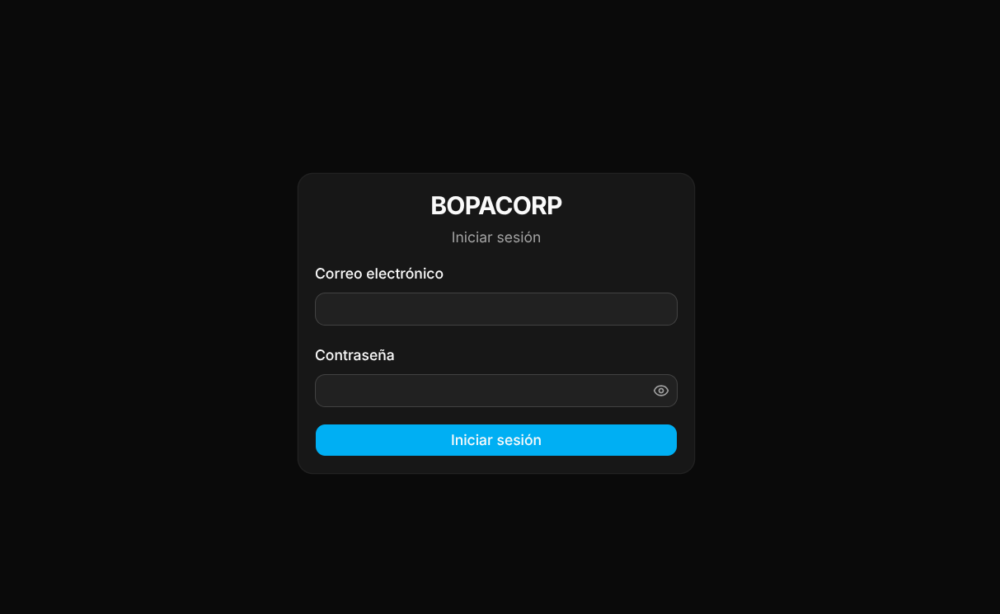

### Paso 2. Escribir las credenciales

Ingrese el correo corporativo y la contraseña en los campos correspondientes.

### Paso 3. Iniciar sesión

Seleccione **Iniciar sesión**. Si los datos son correctos, el sistema mostrará la pantalla inicial que corresponda al perfil.

> **IMPORTANTE:** no comparta la contraseña. Si el usuario se bloquea por intentos fallidos, un manager o administrador puede desbloquear la cuenta desde la administración del equipo.

## 5. Elementos generales de la interfaz

### 5.1 Menú lateral

El menú lateral contiene las secciones autorizadas para el usuario. En la instalación actual pueden aparecer:

- Inicio o métricas.
- Clientes.
- Negociaciones.
- Documentación.
- Reportes.
- Catálogo.
- Empleabilidad.
- Organización.

El menú se adapta al ancho de la pantalla y puede contraerse mediante el botón de menú.

### 5.2 Barra superior

La barra superior muestra la ruta de navegación y el botón de notificaciones. El indicador de notificaciones informa si existen elementos no leídos.

### 5.3 Notificaciones

1. Seleccione el ícono de campana.
2. Revise las notificaciones recientes.
3. Seleccione una notificación para marcarla como leída.
4. Use **Marcar todo como leído** cuando corresponda.

La vista actual muestra las notificaciones recientes y no una página histórica completa.

### 5.4 Idioma, tema y cierre de sesión

Desde el menú del usuario se puede:

- Cambiar entre español e inglés.
- Elegir tema claro, oscuro o del sistema.
- Cerrar la sesión.

## 6. Inicio y métricas generales

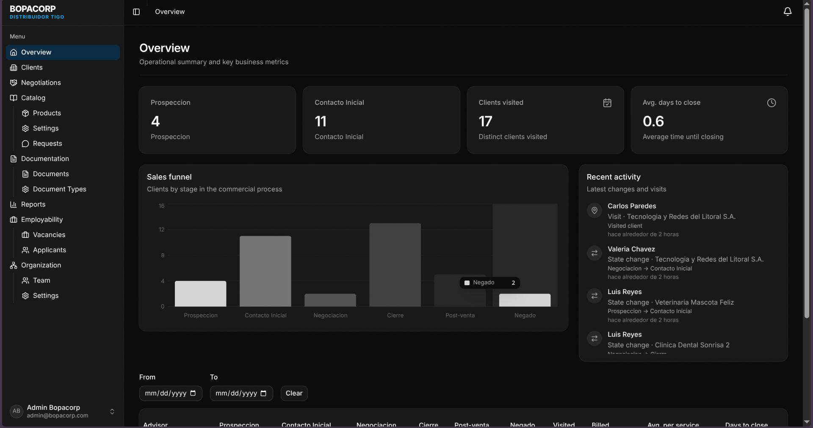

La pantalla de inicio presenta indicadores relacionados con la actividad comercial. Dependiendo del perfil puede mostrar:

- Negociaciones por estado.
- Clientes visitados.
- Días promedio de cierre.
- Actividad reciente.
- Métricas agrupadas por asesor.
- Gráficos de embudo o rendimiento.

### Paso 1. Consultar los indicadores

Revise las tarjetas superiores para conocer el resumen del período.

### Paso 2. Seleccionar un rango de fechas

Cuando el perfil tiene acceso a métricas de gestión, use **Desde** y **Hasta** para limitar la información.

### Paso 3. Revisar la actividad reciente

Consulte la lista de actividades para identificar cambios de estado, visitas u otras acciones recientes.

> **IMPORTANTE:** los datos visibles dependen del alcance del perfil. Un asesor puede ver sus propios indicadores; un supervisor ve la información de sus asesores supervisados.

## 7. Gestión de clientes

### 7.1 Consultar clientes

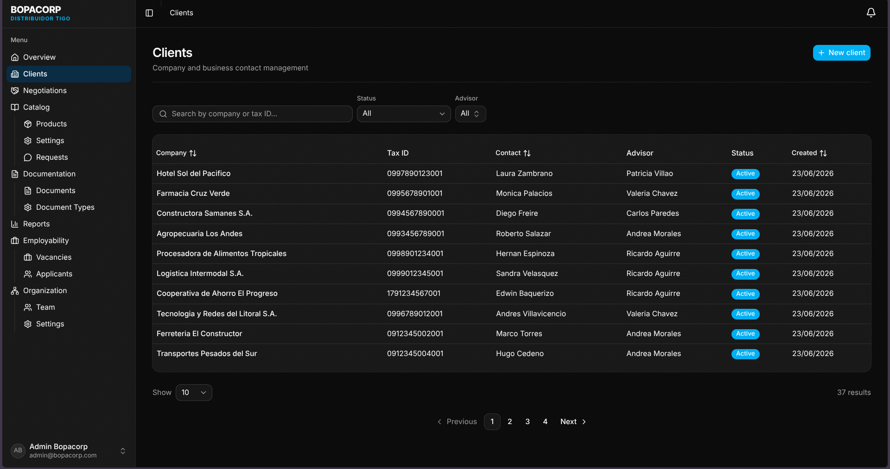

### Paso 1. Abrir Clientes

Seleccione **Clientes** en el menú lateral.

### Paso 2. Buscar un cliente

Escriba parte del nombre o del dato disponible en el buscador. La tabla permite consultar los resultados paginados.

### Paso 3. Filtrar por estado

Use el filtro de estado para consultar clientes activos, inactivos o todos.

### Paso 4. Filtrar por asesor

Los perfiles de gestión pueden utilizar el filtro de asesor. El asesor normalmente trabaja con su propia información.

### 7.2 Crear un cliente

### Paso 1. Seleccionar Nuevo cliente

Seleccione **Nuevo cliente**.

### Paso 2. Completar los datos empresariales

Complete los siguientes campos:

| Campo | Regla de uso |
|---|---|
| RUC | Obligatorio y numérico. |
| Razón social | Obligatorio. |
| Nombre del contacto | Obligatorio. |
| Teléfono | Opcional; debe contener un número válido. |
| Correo | Opcional; debe tener formato de correo. |
| Dirección | Opcional. |
| Servicios activos | Obligatorio, entero igual o mayor que cero. |
| Facturación mensual actual | Obligatoria, igual o mayor que cero. |
| Asesor | Se muestra según el perfil y los permisos. |

### Paso 3. Guardar

Seleccione **Guardar**. El cliente aparecerá en la tabla si la operación termina correctamente.

> **IMPORTANTE:** revise el RUC antes de guardar. La información del cliente se utiliza en negociaciones, visitas, documentos y reportes.

### 7.3 Ver y editar un cliente

Seleccione una fila de la tabla para abrir el detalle.

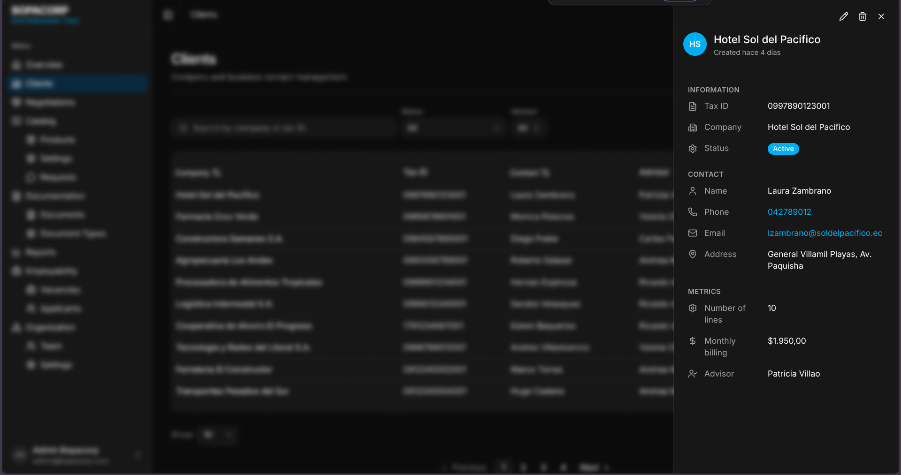

Desde el detalle puede revisar:

- RUC y razón social.
- Estado activo o inactivo.
- Información de contacto.
- Cantidad de servicios activos.
- Facturación mensual.
- Asesor asignado.

Si cuenta con permiso de edición, seleccione **Editar**, modifique los datos y guarde los cambios. Para desactivar un cliente se utiliza el control de estado del formulario.

## 8. Gestión de negociaciones

### 8.1 Consultar negociaciones en tabla

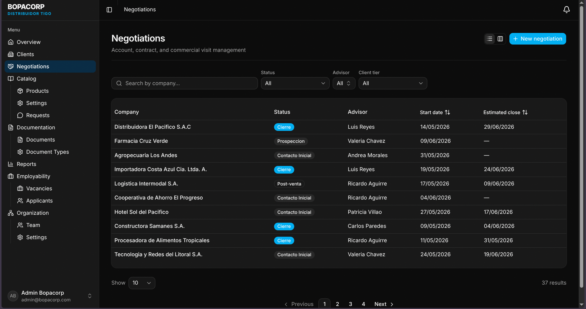

### Paso 1. Abrir Negociaciones

Seleccione **Negociaciones** en el menú lateral.

### Paso 2. Aplicar filtros

La lista permite utilizar:

- Búsqueda.
- Estado de negociación.
- Asesor.
- Tier o categoría comercial.
- Ordenamiento.

### Paso 3. Abrir una negociación

Seleccione una fila para abrir su detalle.

### 8.2 Consultar el tablero kanban

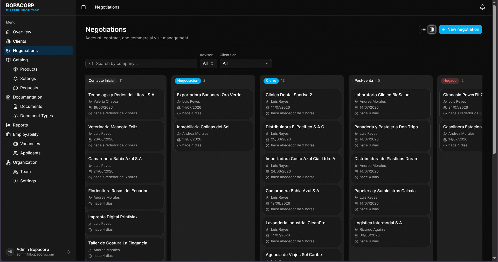

Use el selector de vista para cambiar entre tabla y kanban. Cada columna representa un estado de negociación.

Puede seleccionar una tarjeta para consultar el detalle. En los perfiles autorizados, arrastrar una tarjeta a otra columna inicia el diálogo de cambio de estado.

### 8.3 Crear una negociación

### Paso 1. Seleccionar Nueva negociación

Seleccione **Nueva negociación**.

### Paso 2. Seleccionar el cliente

Busque y seleccione un cliente existente. Si el cliente aún no existe y el formulario lo permite, créelo desde la opción correspondiente.

### Paso 3. Completar la información

Ingrese:

- Cliente.
- Asesor.
- Fecha de inicio.
- Fecha estimada de cierre.
- Observaciones.

El asesor puede quedar establecido automáticamente según el perfil. Los perfiles de gestión pueden seleccionar otro asesor.

### Paso 4. Guardar

Seleccione **Guardar**. La negociación se creará en el estado inicial configurado por el sistema.

### 8.4 Consultar el detalle

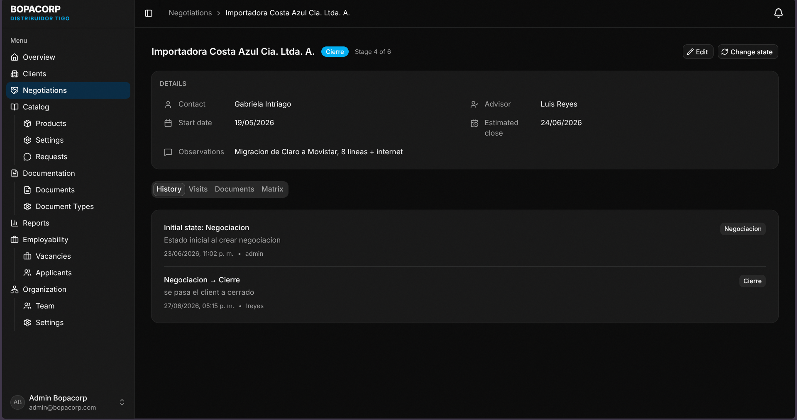

El detalle muestra la empresa, estado, asesor, fechas y observaciones. También contiene las pestañas:

- **Historial:** cambios de estado y notas.
- **Visitas:** visitas asociadas.
- **Documentos:** archivos de la negociación.
- **Matriz:** matriz comercial y adjuntos.

### 8.5 Cambiar el estado

### Paso 1. Abrir la negociación

Abra el detalle desde la tabla o el kanban.

### Paso 2. Seleccionar Cambiar estado

Seleccione el botón de cambio de estado.

### Paso 3. Elegir el nuevo estado

Seleccione el estado disponible. El sistema puede sugerir el siguiente estado del flujo.

### Paso 4. Escribir observaciones

Agregue una nota cuando el estado lo requiera. Las notas permiten explicar la decisión o dejar contexto para el siguiente usuario.

### Paso 5. Adjuntar documentos de cierre

Si el nuevo estado es de cierre y existen tipos de documentos obligatorios pendientes, el sistema solicitará que se adjunten antes de completar la operación.

### Paso 6. Confirmar

Seleccione **Guardar** o **Confirmar**. El nuevo estado aparecerá en el detalle y en el historial.

> **IMPORTANTE:** no marque una negociación como cerrada hasta verificar que la documentación exigida esté completa y corresponda al cliente correcto.

## 9. Registro y verificación de visitas

### 9.1 Consultar visitas

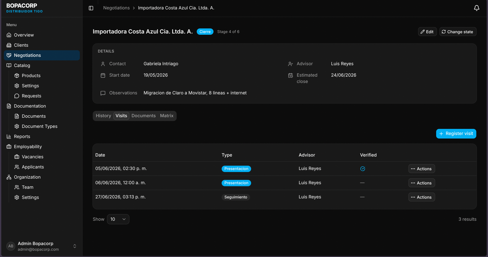

Las visitas se consultan desde la pestaña **Visitas** del detalle de una negociación.

### 9.2 Registrar una visita

### Paso 1. Abrir la pestaña Visitas

Abra una negociación y seleccione **Visitas**.

### Paso 2. Seleccionar Nueva visita

Seleccione el botón de creación.

### Paso 3. Completar los datos

Ingrese:

- Tipo de visita.
- Fecha y hora.
- Asesor.
- Observaciones.

### Paso 4. Permitir geolocalización

Si el navegador solicita permiso, seleccione **Permitir** para guardar coordenadas, precisión y hora de captura.

Si se deniega el permiso, la visita puede continuar sin coordenadas cuando el formulario lo permita.

### Paso 5. Guardar la visita

Seleccione **Guardar**. La visita aparecerá en la tabla.

### 9.3 Verificar una visita

Los perfiles autorizados pueden abrir una visita pendiente de verificación.

1. Abra el detalle de la visita.
2. Revise fecha, asesor, observaciones y datos GPS.
3. Seleccione **Verificar**.
4. Agregue un comentario de supervisor si es necesario.
5. Confirme la operación.

## 10. Gestión de documentación

### 10.1 Consultar documentos

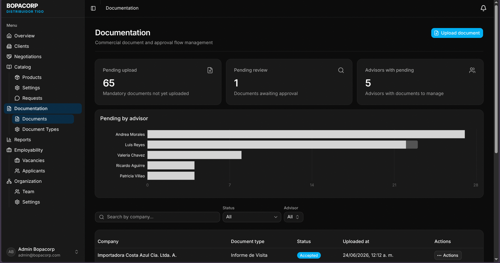

Abra **Documentación** para consultar documentos de las negociaciones autorizadas.

Se puede filtrar por:

- Empresa o búsqueda.
- Estado: pendiente, aprobado o rechazado.
- Asesor, cuando el perfil lo permite.

### 10.2 Subir un documento

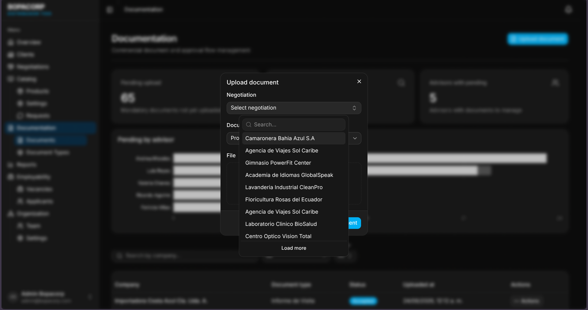

### Paso 1. Seleccionar Subir documento

Seleccione el botón de carga desde la sección Documentación o desde la pestaña Documentos de una negociación.

### Paso 2. Elegir la negociación

Busque y seleccione la negociación a la que pertenece el archivo.

### Paso 3. Elegir el tipo de documento

Seleccione un tipo activo. Los tipos obligatorios se identifican en la lista.

### Paso 4. Seleccionar el archivo

Seleccione un archivo PDF, JPG o PNG de hasta 50 MB.

### Paso 5. Confirmar la carga

Seleccione **Guardar** o **Subir**. El documento se registrará inicialmente como pendiente de aprobación.

> **IMPORTANTE:** verifique la negociación, el tipo documental y el contenido del archivo antes de cargarlo. No suba documentos de otro cliente.

### 10.3 Aprobar o rechazar

1. Abra un documento en estado pendiente.
2. Seleccione **Aprobar** o **Rechazar**.
3. Si rechaza el documento, escriba el motivo.
4. Confirme el cambio.

Los estados documentales principales son:

- **Pendiente de aprobación:** aún no ha sido revisado.
- **Aprobado:** el documento fue aceptado.
- **Rechazado:** requiere corrección o reemplazo.

### 10.4 Descargar documentos

Desde las acciones del documento puede descargar un archivo individual. En la pestaña Documentos de una negociación, los perfiles autorizados también pueden descargar el conjunto disponible como archivo comprimido.

### 10.5 Administrar tipos de documento

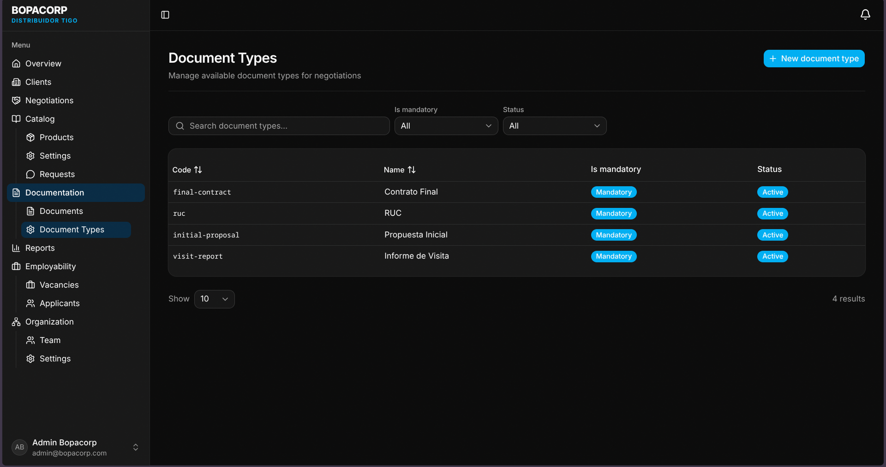

En **Documentación → Tipos de documento**, los perfiles autorizados pueden:

- Buscar tipos.
- Filtrar activos e inactivos.
- Crear un tipo.
- Editar nombre, descripción y obligatoriedad.
- Desactivar un tipo.

## 11. Matrices de oferta

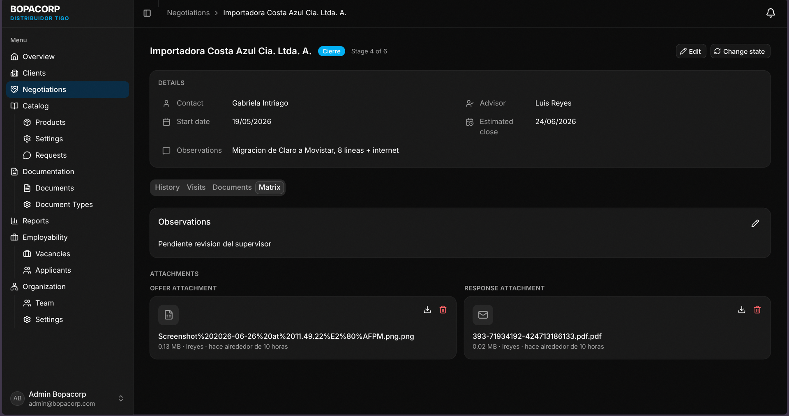

La matriz se administra desde la pestaña **Matriz** de una negociación.

### Paso 1. Crear la matriz

Si la negociación no tiene matriz, seleccione **Crear matriz**.

### Paso 2. Agregar observaciones

Registre la información adicional que el equipo comercial necesite conservar.

### Paso 3. Adjuntar la oferta comercial

En el espacio **Oferta comercial**, cargue un archivo `.xlsx`, `.xls` o `.csv`.

### Paso 4. Adjuntar la plantilla de correo

En el espacio **Plantilla de correo**, cargue un archivo `.msg`, `.eml`, `.pdf` o `.html`.

### Paso 5. Descargar o eliminar adjuntos

Use las acciones de cada archivo para descargarlo o eliminarlo cuando tenga autorización.

> **ALCANCE ACTUAL:** la interfaz implementada administra una matriz básica, observaciones y adjuntos. No se debe documentar como disponible un cálculo automático de subsidios, líneas de productos o aprobación formal de matrices hasta que esas funciones estén implementadas y validadas.

## 12. Reportes

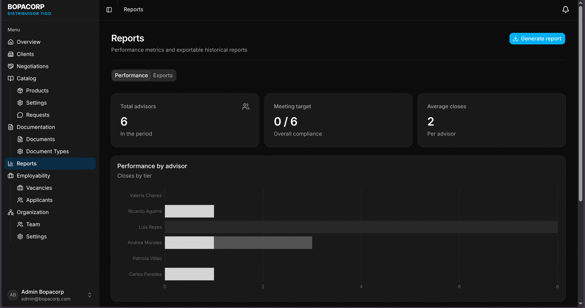

### 12.1 Consultar rendimiento

1. Abra **Reportes**.
2. Seleccione la pestaña **Rendimiento**.
3. Establezca las fechas **Desde** y **Hasta**, si están disponibles.
4. Revise los indicadores de asesores, cierres y cumplimiento.
5. Consulte la tabla por asesor y tier.

Los indicadores pueden incluir total de asesores, asesores que cumplen la meta y promedio de cierres.

### 12.2 Configurar metas

Los perfiles autorizados pueden seleccionar **Configurar metas** y actualizar los valores mínimos o máximos de facturación y cierres.

### 12.3 Exportar métricas

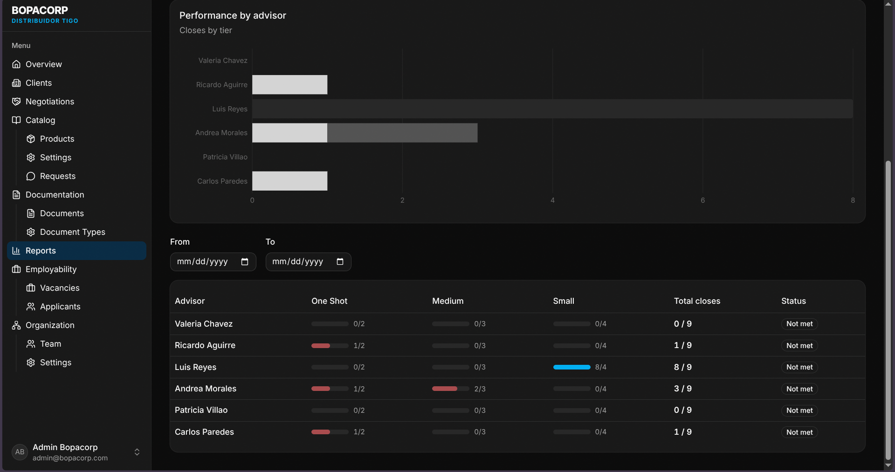

1. Seleccione **Generar reporte**.
2. Elija **Métricas de asesores**.
3. Espere la generación del archivo.
4. Guarde el archivo CSV descargado.

> **IMPORTANTE:** la exportación disponible en la interfaz actual es CSV. No se debe prometer generación de PDF o Excel hasta que esa capacidad sea incorporada.

## 13. Catálogo

### 13.1 Consultar productos

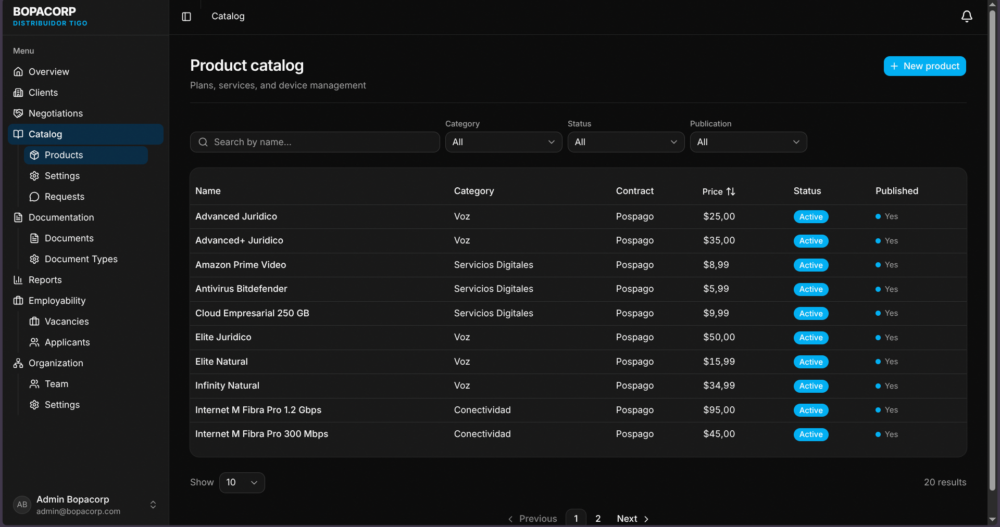

En **Catálogo** se pueden buscar productos y filtrar por categoría, estado activo y publicación.

Seleccione una fila para ver el detalle.

### 13.2 Crear o editar un producto

Complete la información general:

- Nombre.
- Precio.
- Descripción.
- Código de activación, si corresponde.
- Permanencia.
- Categoría.
- Tipo de producto.
- Tipo de contrato.
- Segmento.
- Tier.

El tipo de producto determina los campos técnicos adicionales. Según el tipo, pueden aparecer datos de voz, conectividad, servicio digital, roaming o dispositivo.

También pueden registrarse:

- Beneficios.
- Condiciones de edad.
- Condiciones legales.
- Vigencia y fecha de expiración.

Use **Activo** y **Publicado** según corresponda. Publicar un producto lo habilita para el flujo de catálogo configurado.

### 13.3 Configuración del catálogo

Desde **Catálogo → Configuración** los perfiles autorizados pueden administrar tablas auxiliares como:

- Categorías.
- Tipos de producto.
- Tipos de contrato.
- Segmentos.
- Tiers.
- Zonas geográficas.
- Tipos de beneficio.

El patrón general es buscar, filtrar por estado, crear, editar y desactivar.

### 13.4 Solicitudes de contacto

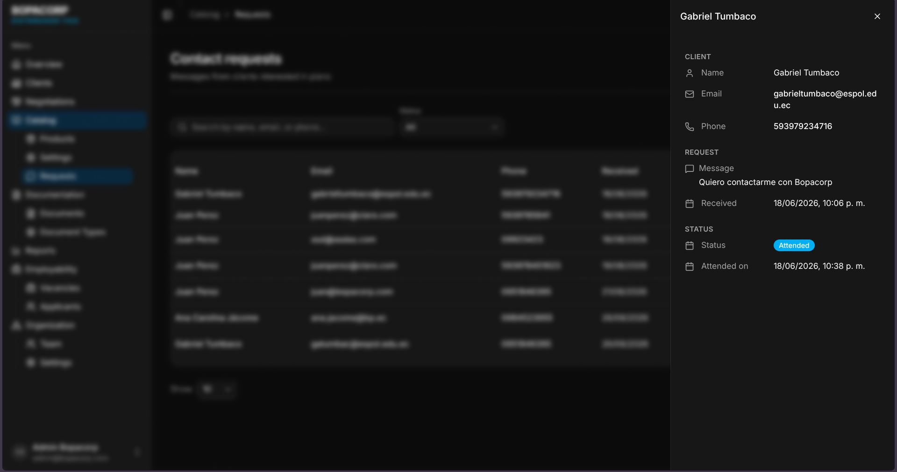

En **Catálogo → Solicitudes** se revisan los mensajes recibidos desde los canales públicos.

1. Busque por nombre o correo.
2. Filtre solicitudes pendientes o atendidas.
3. Abra una solicitud para leer sus datos y mensaje.
4. Seleccione **Marcar como atendida** cuando la gestión haya terminado.

La pantalla no constituye un sistema de respuesta directa; el seguimiento debe realizarse por el canal corporativo correspondiente.

## 14. Organización y equipo

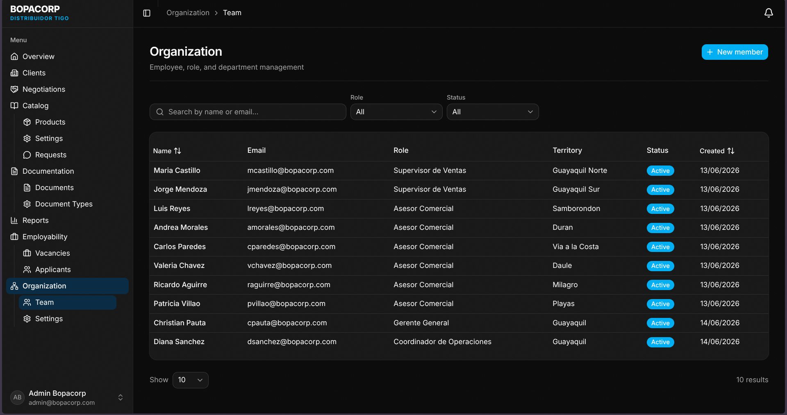

### 14.1 Consultar el equipo

En **Organización → Equipo** se puede buscar por nombre, filtrar por estado o rol y consultar el detalle de un empleado.

### 14.2 Crear un empleado

La creación combina una cuenta de usuario y un registro de empleado.

1. Seleccione **Nuevo empleado**.
2. Cree el usuario con nombre de usuario, correo, contraseña y rol de acceso.
3. Complete nombres, apellidos e identificación.
4. Seleccione el rol organizacional.
5. Agregue datos opcionales como teléfono, dirección, territorio y fecha de ingreso.
6. Si el rol es asesor, asigne supervisores cuando corresponda.
7. Guarde la información.

> **IMPORTANTE:** el rol de acceso y el rol organizacional son conceptos distintos. Verifique ambos antes de guardar.

### 14.3 Editar o desactivar

Abra un empleado, seleccione **Editar**, modifique rol organizacional, territorio, fecha de ingreso o estado y guarde.

### 14.4 Desbloquear un usuario

1. Abra el empleado bloqueado.
2. Seleccione **Desbloquear**.
3. Escriba un motivo de al menos 10 caracteres.
4. Confirme la operación.

### 14.5 Configuración organizacional

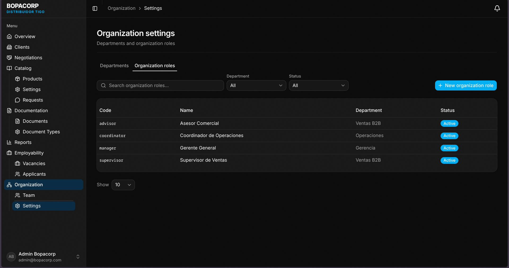

En **Organización → Configuración** se administran departamentos y roles organizacionales mediante las acciones de crear, editar y desactivar.

## 15. Empleabilidad

### 15.1 Administrar vacantes

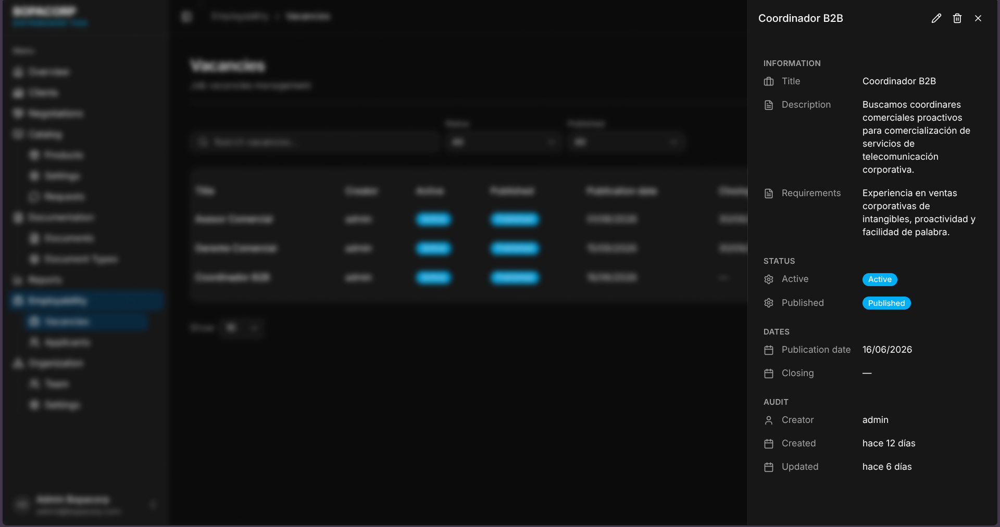

### Paso 1. Abrir Vacantes

Seleccione **Empleabilidad → Vacantes**.

### Paso 2. Crear una vacante

Seleccione **Nueva vacante** y complete título, descripción y requisitos.

### Paso 3. Definir fechas

Ingrese fecha de publicación y fecha de cierre cuando corresponda. La fecha de cierre no debe ser anterior a la fecha de publicación.

### Paso 4. Definir estado

Use los controles **Activa** y **Publicada** para controlar la disponibilidad.

### Paso 5. Guardar

Seleccione **Guardar**. La vacante aparecerá en la tabla.

### 15.2 Revisar postulantes

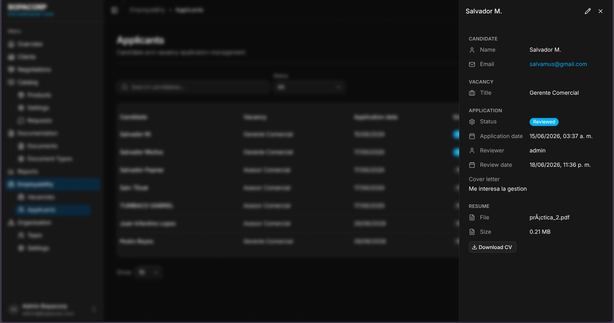

1. Seleccione el número de postulantes de una vacante o abra **Empleabilidad → Postulantes**.
2. Busque por candidato.
3. Filtre por estado.
4. Abra el detalle de una postulación.
5. Revise carta de presentación, datos de la vacante, estado y CV.

### 15.3 Cambiar estado de una postulación

1. Abra el detalle.
2. Seleccione **Cambiar estado**.
3. Elija el nuevo estado.
4. Escriba notas de revisión cuando sea necesario.
5. Confirme.

Los estados disponibles son **Borrador**, **Pendiente**, **Aceptado/Revisado** y **Rechazado**.

Si la postulación tiene CV y el perfil posee autorización, use **Descargar CV**.

## 16. Estados frecuentes

| Estado | Significado |
|---|---|
| Activo | Registro habilitado para operar. |
| Inactivo | Registro deshabilitado sin eliminar necesariamente su historial. |
| Pendiente de aprobación | Requiere revisión de un perfil autorizado. |
| Aprobado | Revisión completada satisfactoriamente. |
| Rechazado | Requiere corrección, reemplazo o nueva revisión. |
| Borrador | Registro todavía no publicado o finalizado. |
| Verificado | La visita fue validada por un perfil autorizado. |
| Atendido | La solicitud de contacto ya fue gestionada. |

Los estados concretos de una negociación se cargan desde la configuración del sistema y pueden variar entre instalaciones.

## 17. Problemas frecuentes

### No aparece una opción del menú

Revise el perfil y los permisos. El menú se oculta cuando el usuario no tiene autorización.

### No puedo subir el archivo

Verifique que sea PDF, JPG o PNG y que no supere 50 MB. Compruebe también que haya seleccionado negociación y tipo documental.

### No puedo cerrar la negociación

Revise si el estado de cierre exige documentos obligatorios. Adjunte los archivos faltantes y repita la operación.

### No aparece el GPS de la visita

Verifique que el navegador tenga permiso de ubicación y que el dispositivo tenga habilitada la geolocalización. La visita puede quedar registrada sin GPS si el permiso fue denegado.

### No veo datos de otros asesores

El alcance está restringido por perfil. Solicite apoyo a un supervisor, manager o administrador si necesita consultar información adicional.

### El cambio de permisos no aparece

Los permisos se incorporan al iniciar sesión. Cierre sesión y vuelva a ingresar después de un cambio de rol o permisos.

## 18. Recomendaciones de seguridad

- No compartir credenciales.
- Cerrar sesión al abandonar el equipo.
- No cargar documentos de un cliente en otra negociación.
- Verificar el destinatario y el tipo de archivo antes de guardar.
- Utilizar datos anonimizados en ambientes de demostración.
- No descargar ni conservar documentos comerciales en equipos no autorizados.

## 19. Referencias de implementación

Este apartado sirve para la trazabilidad del reporte, no para el usuario operativo:

- Rutas del frontend: `bopacorp-crm/src/App.tsx`.
- Navegación: `bopacorp-crm/src/app/Sidebar.tsx`.
- Permisos de frontend: `bopacorp-crm/src/modules/auth/constants.ts`.
- API: `bopacorp-api/src/server.ts` y módulos bajo `src/modules`.
- Contratos: `bopacorp-shared/src`.
- Auditoría de alcance: `bopacorp-crm/docs/gaps/requirements-audit.md`.
